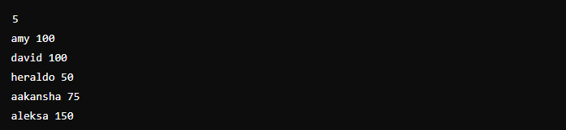
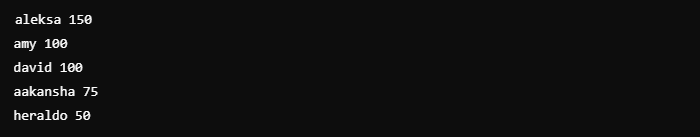

# Compare and order objects

## Challenge Description:

The code challenge in question involves creating a Comparator in Java, used to compare and order objects of\
a Player class with two attributes: name (String) and score (integer).

Objective: Create a Checker class that implements the Comparator interface and implement the compare(Player a,\
Player b) method, which should sort a list of players based on the following criteria:

  - Sort in descending order of score.\
  - If two or more players have the same score, they should be sorted alphabetically by name.

Enter:
  - The first input value is an integer, which indicates the number of players.\
  - Each of the subsequent lines contains a player name (String) and their respective score (integer).

Outputs:
  - The output is generated by an already blocked code (which does not need to be implemented), which uses\
 the Checker created to sort the list and print the players ordered according to the rules.

### Example input:

### Example output:

    
